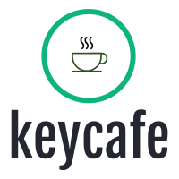
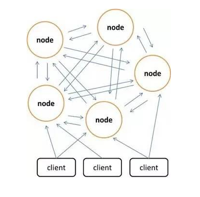
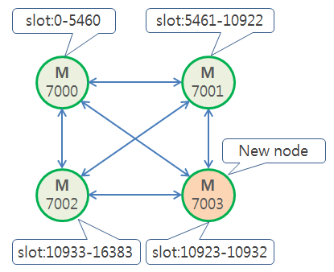
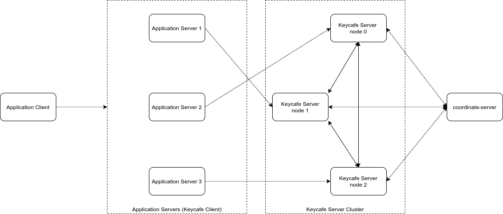
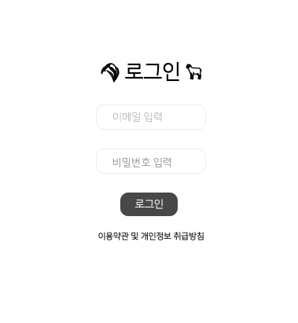

<div align="center">
  <br/>
  
  <br/>
  <br/>
  <p>
    The simple, lightweight, distributed in-memory key-value store using netty. <br/>
    Focusing on supporiting scalable, high-availability application.  
  </p>
  <p>
    <a href="https://github.com/actumn/keycafe/blob/master/LICENSE">
      
    </a>
  </p>
</div>

---
## Introduction


Keycafe is the simple distributed key-value in-memory database implementation supporting `String` data structure, for research purpose how to build the simple distributed system from scratch. Keycafe is focusing on stroing key-value entry in memory which means reading faster than existing relational database. Also, more than one nodes form a cluster system and distribute key-value entries to extend the entire throughput. User can do `GET`, `SET`, `DELETE` commands. Entries are stored in `slot`, the logical block of Keycafe, which came from [the keys distribution model of Redis](https://redis.io/topics/cluster-spec#keys-distribution-model). There are multiple logical slots in Keycafe cluster and the hash alogorithm is used to map the key to consistent hash slot. Slots are maintained by Keycafe cluster nodes.


### Clustering


### Slots


## Architecture


### Coordinate Server
`coordinate-server` is a centralized service for maintaining server configuration or providing a solution to divide slots which is shared resource of cluster into Keycafe server cluster. With the server configuration information provided by `coordinate-server`, Keycafe server can discover other Keycafe servers and have a chance to share slots fairly between nodes. 


### Keycafe Server
Keycafe의 목표는 메모리에 키 - 값 엔트리를 저장하여, 기존의 데이터베이스 시스템 보다 더 빨리 엔트리를 조회할 수 있도록 하는 것이다. 두번째는 하나 이상의 노드가 클러스터를 형성한 뒤 엔트리를 분산시켜 저장하여 용량 및 처리량을 확장하거나, 축소할 수 있도록 하는 것이다. 사용자는 엔트리를 조회 (GET), 저장 (SET) 및 삭제 (DELETE) 할 수 있다. 엔트리는 문자열 (String) 타입만을 지원한다. 엔트리들은 슬롯 (Slot) 이라 하는 논리적 엔트리 블록에 저장된다. Keycafe에는 다수의 논리적 슬롯이 존재하며, 키를 총 슬롯 수에 대해 일관적 해싱을 취한 값과 같은 인자를 가지는 버킷에 엔트리를 저장한다. 슬롯들은 Keycafe 클러스터의 노드들이 유지한다.
 
### Keycafe Client
Because Keycafe uses its own TCP binary protocol, Keycafe client provides a simple method to communicate Keycafe server. 
- Example code 
```java
public class Main() {
    public static void main(String[] args) {
        KeycafeCluster keycafe = new KeycafeCluster("localhost", 9814);
        System.out.println(keycafe.set("example_key", "KEY"));  // "ok"
        System.out.println(keycafe.get("example_key"));         // "KEY"
        System.out.println(keycafe.get("no_key"));              // null
        keycafe.close();
    }
}
```

### Example (auth-server, auth-web)


`auth-server` is a simple authentication server to show how to use Keycafe key-value store. Displaying a simple auth with `auth-web`, the example provides the web-based use case in an application level. 

## Build and run
```shell script
$ ./build.sh
```
### Gradle
- Build
```shell script
$ ./gradlew build
```
- Make Executable jar
```shell script
$ ./gradlew :coordinate-server:jar
$ ./gradlew :server:jar
```
- run
```shell script
$ java -jar coordinate-server/build/libs/coordinate-server-0.0.1.jar
$ java -jar server/build/libs/server-0.0.1.jar
```
### Docker
- Dockerfile
```shell script
$ docker build -f docker/coordinate-server/Dockerfile .
$ docker build -f docker/server/Dockerfile .
```
- docker-compose build
```shell script
$  docker-compose -f docker/docker-compose.yml build
```

## Internal specification
### Keycafe commands
- Request
- Reply

### Keycafe cluster
- TCP connection bus
- Keycafe cluster messages
- Client keycafe cluster discover

### Coordination
- Register node information.
- Notify new node joining the cluster.


